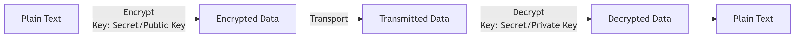
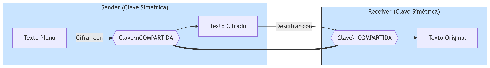
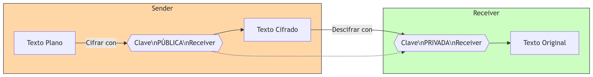

# SEGURIDAD EN REDES

Adán Alvarez, Christopher Mendoza, Josue Vera

## Capítulo 8 (5ª Edición)

### Secciones 8.1 - 8.3

Andrew S. Tanenbaum, David J. Wetherall

---

    
    

---

---

# CIA

---

---

# Confidencialidad

---
# Integridad

---

# Disponibilidad

---
## Authenticity
## Accountability

---

---

# Criptografía

---

# $C = E_K(P)$

---

# $P = D_K(C)$

---

# $P = D_K(E_K(P))$

---

---

---

# Sistemas de cifrado por sustitución

En un sistema de cifrado por sustitución, cada letra o grupo de letras se reemplazan por otra letra o gru­po de letras para disfrazarla. Uno de los sistemas de cifrado más viejos conocido es el sistema de cifrado de César, atribuido a Julio  César. En este método, a se vuelve D, b se vuelve E, c se vuelve F, ... , y z se vuelve C. Por ejemplo, ataque se vuelve DWDTXH. En nuestros ejemplos, el texto plano se presentará en minúsculas y el texto cifrado en mayúsculas.

---

### Cifrado por sustitución monoalfabética

## $26! ≈ 4 \times 10^{26}$

---

### Cifrado por transposición

---

# Criptografía cuántica

---

BB84 (Bennet y Brassard, 1984).

---

## 1. Incondicionalmente Segura

## 2. Computacionalmente Segura

---
# Clave Simétrica
---

---

---
# Clave Asimétrica
---

---
